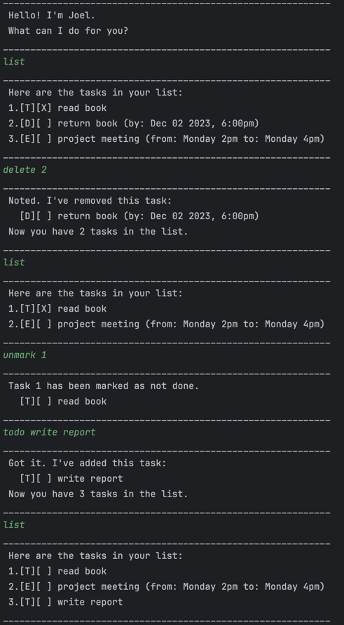

# Joel Chatbot User Guide

Welcome to **Joel**, your personal task management chatbot! Joel helps you manage your tasks efficiently through a simple command-line interface.

---

##  Product Screenshot

---

##  Introduction

Joel is a simple yet powerful chatbot that helps you manage your tasks. You can add tasks, set deadlines, schedule events, mark tasks as done, search for tasks, and more — all from your terminal.

---

## Features

### Add a ToDo Task

Add a simple task without any date/time.

**Command:**

todo read book

**Expected Output:**

Got it. I've added this task:
[T][ ] read book
Now you have 1 task in the list.

---

### Add a Deadline Task

Add a task with a specific deadline.

**Command:**

deadline return book /by 2023-12-02 18:00

**Expected Output:**

Got it. I've added this task:
[D][ ] return book (by: Dec 02 2023, 6:00PM)
Now you have 2 tasks in the list.

*Note: Use the format `yyyy-MM-dd HH:mm` for deadlines.*

---

### Add an Event Task

Add a task with a start and end time.

**Command:**

event project meeting /from Monday 2pm /to Monday 4pm

**Expected Output:**

Got it. I've added this task:
[E][ ] project meeting (from: Monday 2pm to Monday 4pm)
Now you have 3 tasks in the list.

---

###  List All Tasks

View all tasks currently in your list.

**Command:**

list

**Expected Output:**

Here are the tasks in your list:
1.[T][ ] read book
2.[D][ ] return book (by: Dec 02 2023, 6:00PM)
3.[E][ ] project meeting (from: Monday 2pm to Monday 4pm)

---

###  Mark a Task as Done

Mark a task as completed.

**Command:**

mark 2

**Expected Output:**

Task 2 has been marked completed.
[D][X] return book (by: Dec 02 2023, 6:00PM)

---

###  Unmark a Task

Mark a task as not done.

**Command:**

unmark 2

**Expected Output:**

Task 2 has been marked as not done.
[D][ ] return book (by: Dec 02 2023, 6:00PM)

---

###  Find Tasks by Keyword

Search for tasks containing a specific keyword.

**Command:**

find book

**Expected Output:**

Here are the matching tasks in your list:
1.[T][ ] read book
2.[D][ ] return book (by: Dec 02 2023, 6:00PM)

---

### Exit the Chatbot

End the session.

**Command:**

bye

**Expected Output:**

Bye. Hope to see you again soon!